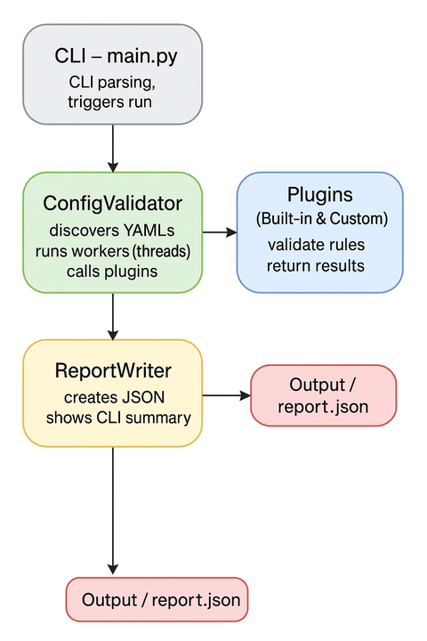

# 🚀 Concurrent Configuration Deployment Validator

A **production-grade Python tool** designed to **discover, validate, monitor, and report** on YAML-based deployment configurations.  
It features a plugin-based architecture, concurrent validation, and structured JSON reporting.

---

## 🧩 Features

### ✅ YAML Discovery
- Recursively scans all `.yaml` and `.yml` files within a directory.

### ⚡ Concurrent Validation
- Uses Python’s `ThreadPoolExecutor` to process multiple files simultaneously.

### 🧱 Built-in Validation Rules
- Required fields: `service`, `image`, `replicas`  
- `image` must follow the pattern: `<registry>/<service>:<version>`  
- `replicas` must be an integer between **1 and 50**  
- Environment keys (`env`) must be **UPPERCASE**

### 🔌 Plugin Architecture
- Add new validation rules without modifying the core codebase.  
- Drop-in plugin support using a simple, extensible interface.

### 📊 JSON Report
Generates a structured report including:
- ✅ Valid files  
- ❌ Invalid files + error details  
- 📦 Registry usage summary  
- 📈 Total issue count

### 👀 Watch Mode (optional)
- Automatically re-validates on file changes using `watchdog`.

---

## 🛠️ Installation

```bash
# 1. Create virtual environment
python3 -m venv .venv
source .venv/bin/activate

# 2. Install dependencies
pip install -r requirements.txt
```

---

## ▶️ Usage

**Single run (local):**
```bash
python -m src.main --path ./examples --output report.json
```

**Watch mode (auto revalidation):**
```bash
python -m src.main --path ./examples --watch
```

**Set number of threads (default: 6):**
```bash
python -m src.main --path ./examples --threads 12
```

---

## 🧪 Running Tests

```bash
pytest -v
pytest --cov=src
```

---

## 🐳 Docker Support

**Build the image:**
```bash
make docker-build
# or
docker build -t config-validator .
```

**Run the validator:**
```bash
make docker-run
# or
docker run --rm -v $(pwd)/examples:/app/examples config-validator   python -m src.main --path /app/examples
```

---

## 🧭 Architecture Diagram



---

## 🔮 Future Improvements

- 🤖 **Slack bot integration** for automated alerts  
- 📅 Scheduled runs (cron or CI pipeline)  
- 🚨 Notifications when:
  - New invalid YAML files appear  
  - `replicas` out of range  
  - Deprecated fields detected  
  - Registry usage changes unexpectedly  

**Example Slack alert:**
```
🔔 Config Validator Alert
3 invalid YAML files detected in the last commit.
Check: #devops-config-issues
```

---

## 📌 Design Decisions

- Plugin system for flexible rule extensions  
- `ThreadPoolExecutor` chosen for IO-bound performance  
- `watchdog` for real-time monitoring  
- Code follows PEP8 and DevOps clarity principles  
- Comprehensive test coverage (core + plugins + reporting)

---

## 👨‍💻 Author

**Henrique Freitas**  
Site Reliability Engineer — DevOps | Cloud | Automation | Observability
